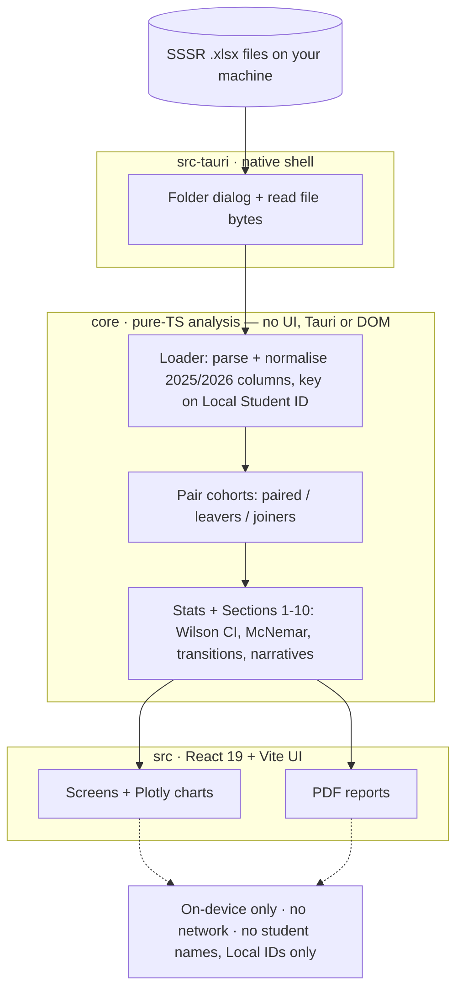

# NAPLAN Cohort Tracker

> ### ⬇️ Just want the app? → **[Download page](https://mrdavearms.github.io/naplan-cohort-tracker-releases/)**
> Big "Download for Mac / Windows" buttons, plus how to open it the first time.
> (Or grab an installer straight from the [latest release](https://github.com/mrdavearms/naplan-cohort-tracker-releases/releases/latest).)
> This README below is for developers.

---

Cross-platform desktop app (**Tauri 2 + React 19 + TypeScript**) for NAPLAN
cohort analysis. **On-device, local-only, multi-school.** A from-scratch rewrite
of an internal Python/Streamlit tool.

## What this app does

NAPLAN Cohort Tracker analyses your school's NAPLAN **Preliminary** results. Each
year ACARA (the Australian Curriculum, Assessment and Reporting Authority)
releases a preliminary Student and School Summary Report (SSSR), usually during
Term 2. The preliminary SSSR gives schools the School (IDA) Report, Class Summary
Report, Class Test Report, Student Reports and proficiency-standard information.

This app reads those files and surfaces participation, proficiency, equity and
skill gaps and — the headline — the **same students tracked across two years**
(Year 3→5 for a primary school, Year 7→9 for a secondary, or Year 5→7 in a
combined P–12 — the school's value-add), with both an on-screen view and PDF
reports. No student data leaves the machine; no student names appear anywhere.

## Which files you need

Add all the files from the **SSSR Preliminary reports** — for your current
exit-year cohort (Year 5 or Year 9), **and** the same students' entry-year files
(Year 3 or Year 7) from two years earlier — across every domain (Reading,
Numeracy, Spelling, Grammar and Punctuation) and both year levels. The files for
each year can sit in **different folders**: the app lets you add several folders
(or pick files directly), confirm the year for anything it can't detect, then
build the analysis from the whole set.

**Where to get them:** Principals download the data from the national assessment
platform (Assessform). Log in to the NAPLAN portal for the year you need, using
the same credentials your school used for the March test, then download the SSSR
Preliminary report files.

→ **For school leaders: see [docs/USER-GUIDE.md](docs/USER-GUIDE.md).**

## Developer & contact

Developed by **Dave Armstrong, a Victorian school Principal**. To report
problems, issues or feature requests, email
**[dave.armstrong@education.vic.gov.au](mailto:dave.armstrong@education.vic.gov.au)**.

## Disclaimer

This app has been produced with care, but it is a **support tool — not an
official source of truth**. Every figure, chart and report it produces should be
checked carefully by an experienced staff member before it is relied on or
shared.

## Layout

Three strictly separated layers — the native shell reads bytes, the pure-TS core
analyses them, the UI renders. Nothing leaves the machine.



| Path | What |
|---|---|
| `core/` | Pure-TypeScript analysis library — **no UI, no Tauri, no filesystem, no DOM.** Loader, stats (Wilson CI, McNemar, transition matrix), all 10 sections, narratives, chart specs. Validated against the legacy Python oracle. |
| `src/` | React 19 + Vite + Tailwind v4 UI. Consumes `core/`. Plotly charts, PDF generation. |
| `src-tauri/` | Tauri 2 native shell — window, native folder dialog + file reads, logging, auto-updater, packaging. |

`core/` stays filesystem-free: the native layer discovers files and reads bytes,
then injects them into `core/`.

## Develop

```bash
npm install
npm run dev        # Vite dev server in the browser (no Rust needed)
npm test           # vitest — core + UI projects (216 tests)
npm run typecheck  # tsc -b (core) + app typecheck
npm run build      # production web build
```

Requires **Node 22+**. The desktop shell additionally needs **Rust**:

```bash
npm run tauri dev    # native dev window (hot-reloads the frontend)
npm run tauri build  # .dmg/.app (macOS) — unsigned for v1
```

## Install (unsigned builds)

v1 ships **unsigned** (the audience is personal/unmanaged machines), so the OS
will warn the first time:

- **macOS:** after the first launch attempt, open **System Settings → Privacy &
  Security** and click **Open Anyway** (macOS Sequoia 15+ removed the old
  right-click → Open shortcut for unsigned apps; it still works on older macOS).
  On Apple Silicon the build is ad-hoc signed to avoid the "app is damaged" dialog.
- **Windows:** SmartScreen → **More info** → **Run anyway**.

## Privacy

- On-device, **no external network calls**; the only outbound request is the
  auto-updater asking GitHub "is there a newer version?" (no student data).
- No student names in any chart, table, export or PDF — Local Student IDs only.
- Small subgroups (n < 5) are suppressed with the privacy note kept visible.

## Docs

- [docs/USER-GUIDE.md](docs/USER-GUIDE.md) — one-page guide for school leaders.
- [CHANGELOG.md](CHANGELOG.md) — what changed in each release.
- [PLAN.md](PLAN.md) — the roadmap and locked architecture decisions.
- [DECISIONS.md](DECISIONS.md) — build decisions (one line each).
- [HANDOFF.md](HANDOFF.md) — current status, how to build/run, and outstanding items.
- [CLAUDE.md](CLAUDE.md) — data-format quirks, keying rule, analysis conventions.
